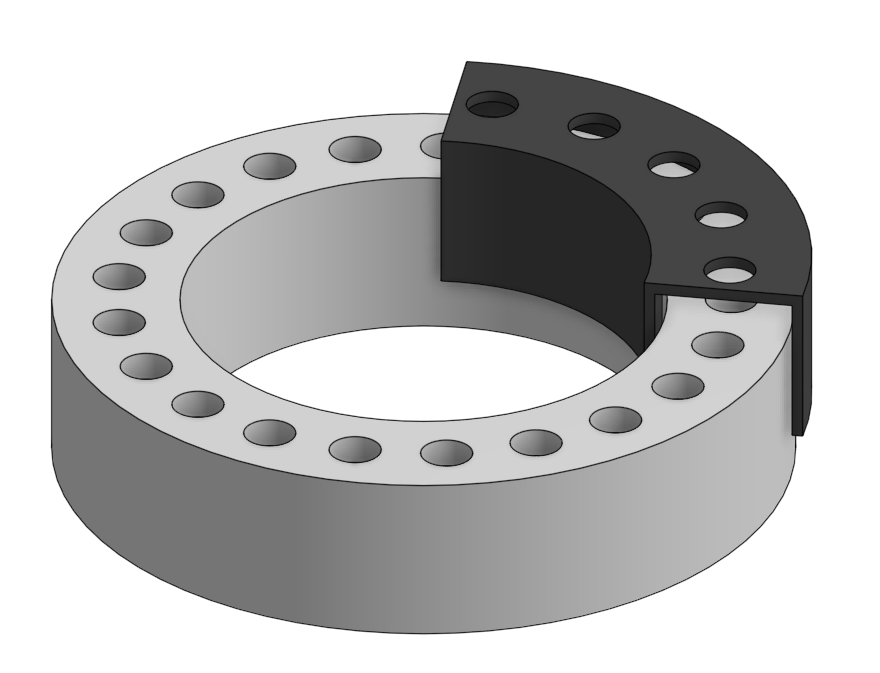
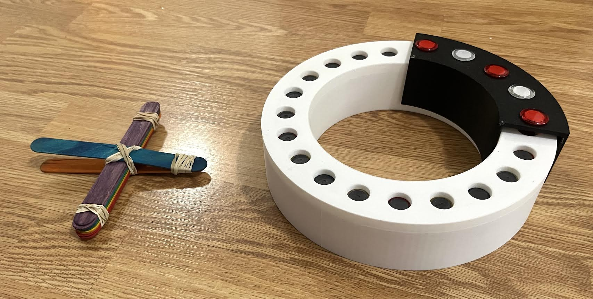

# Maglev-Train
Files and images for my homemade Maglev Train

This respository is for my Maglev train project. It includes the Final STL files for my Maglev Train. 

## Public Onshape
https://cad.onshape.com/documents/ca7f9dd15de26119312515e9/w/9644ee87d97acfb09d4b386d/e/605830fbe88ced165cf9d9ec?renderMode=0&uiState=6a3abeb0a00f13c41af5a756

The magnets used were Dollarama 12 pc clear magents. No affiliation with them at all, but these worked best for me because they were easy to find a lot of. The hole sizes on the CAD are based on how these magnets fit.

Below are some notable images:

## CAD of Train and Track

## Train, Track, and Launcher

